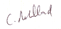

Merci Edgar  
13 rue Truillot  
Bâtiment C15  
94200 Ivry sur Seine  
N°RNA: W782005393

A l'attention de {{ name }}  
{{ accountName }}

## Objet : Reçu de cotisation

Cher membre adhérent,

Nous avons bien reçu votre déclaration en date du {{ date | date: "%d/%m/%Y" }} ainsi que le règlement de votre cotisation et nous vous en
remercions. Pour les besoins de votre comptabilité, nous attestons par la présente que vous avez dûment acquitté auprès de
notre association :

- un montant de {{ amount }} euros
- en date du {{ date | date: "%d/%m/%Y" }} au titre de la cotisation due à raison de votre adhésion à notre association pour la période
allant du {{ date | date: "%d/%m/%Y" }} jusqu'au {{ last | date: "%d/%m/%Y" }}.

Nous vous rappelons que la cotisation n’est pas soumise à la TVA et qu’elle ne donne pas lieu à la délivrance d’une facture.
Elle n’ouvre pas droit au bénéfice des dispositions des articles 200, 238 bis et 885-0 V bis Adu code général des impôts.

Nous vous prions d’agréer, cher membre adhérent, nos sincères salutations.

Le président  
Christophe Robillard  

